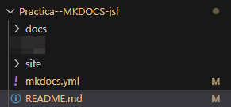
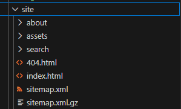
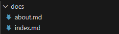
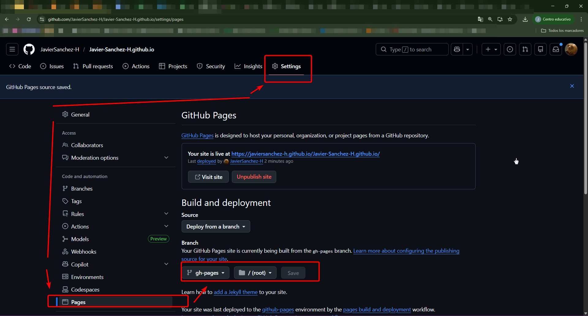
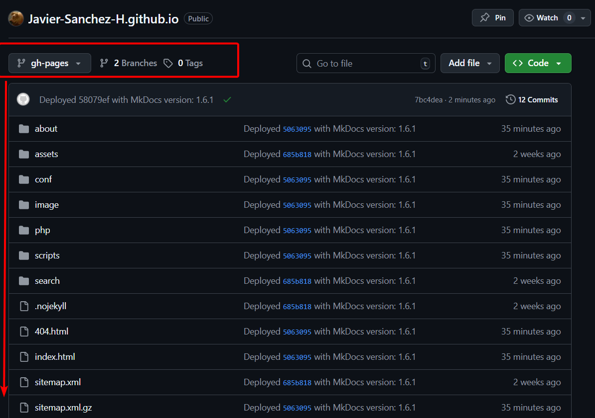
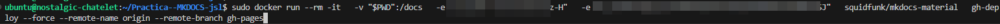
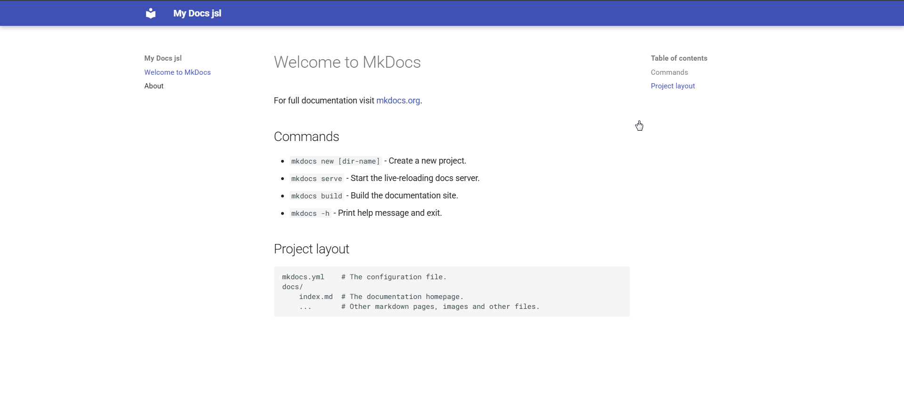

# Practica--MKDOCS-jsl
Practica -MKDOCS
# Para la practica es necesario descargar los archivos necesarios:

# Es muy importante tener en GITHUB en SETTINGS el sites de pages hecho 

# Luego con el comando 

# Podremos acceder a https://javiersanchez-h.github.io/Practica--MKDOCS-jsl/

